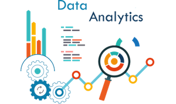

## 🚀 My Project Portfolio

Welcome to my curated project showcase! Below you'll find a collection of my key projects demonstrating my work in Machine Learning, Deep Learning, Generative AI, Full-Stack development, and NLP.

---

## 📫 Contact Me
Feel free to connect or collaborate!

🔗 [LinkedIn](https://linkedin.com/in/kaisarhossain/) • 📧 kaisar.hossain@gmail.com
---

## 🩺 AI Dermatologist: Discreet & Accessible Skin Health Guidance (JUL'2025)

**Summary:** Built an AI Dermatologist web application for preliminary skin condition analysis, integrating multimodal AI for image and symptom assessment with natural language processing.  
**Tech Stack:** `Streamlit` `|` `Groq API` `|` `Llama (Multimodal)` `|` `gTTS` `|` `Python` `|` `Pydub` `|` `FPDF` `|` `Pillow` 
🎥 [Watch Demo](https://youtu.be/Jlgfb5rJ0eY)

---

## 🤖 NLP Chatbot & Order Management System (JUN'2025)

**Summary:** Built an intelligent chatbot with integrated order management using Dialogflow and FastAPI.  
**Tech Stack:** `Dialogflow` `|` `NLP` `|` `FastAPI` `|` `MySQL` `|` `Python` `|` `Ngrok` `|` `JavaScript`  
🎥 [Watch Demo](https://youtu.be/FXdmZJ5D6ME)

---

## 📈 Urban Form Dashboard (MAY'2025)

**Summary:** This project analyzes spatial and transit-related data from over 4,900 U.S. transit stations to identify urban development patterns within proximity buffers (200m, 400m, 800m). The outcome is an interactive Streamlit dashboard that leverages advanced data analytics and visualization techniques to provide insights into the distribution of buildings, facility types, and transit modes, aiding in urban planning and development decisions.  
**Tech Stack:** `Streamlit` `|` `Python` `|` `streamlit-folium` `|` `Stream Cloud` `|` `plotly-express` `|` `Seaborn` `|` `Matplotlib`  
📈 [Watch Demo](https://tod-urbanform-dashboard.streamlit.app/?embed_options=light_theme,show_toolbar)

---

## 🌿 Plant Disease Detection & Cure (APR'2025)

**Summary:** Developed a CNN model that identifies plant diseases from leaf images and suggests treatments.  
**Tech Stack:** `Python` `|` `TensorFlow` `|` `Keras` `|` `OpenCV` `|` `JavaScript` `|` `FastAPI`  
🎥 [Watch Demo](https://youtu.be/QVX944amiuU)

---

## 🧾 Job Hunt Automation using RAG (MAR'2025)

**Summary:** A Retrieval-Augmented Generation (RAG) system to automate job applications and document creation.  
**Tech Stack:** `Python` `|` `LangChain` `|` `ChromaDB` `|` `OpenAI/Groq` `|` `Streamlit`  
🎥 [Watch Demo](https://youtu.be/i1Zrmp6KFGs)

---

## 🧠 Automatic Content Creator using GenAI (FEB'2025)

**Summary:** A Generative AI tool that creates articles, resumes, and summaries from web links or raw text.  
**Tech Stack:** `LangChain` `|` `Groq Cloud` `|` `Python` `|` `LLMs`  
🎥 [Watch Demo](https://youtu.be/nZsBJbWv_h8)

---

## 🏦 Loan Eligibility Prediction System (DEC'2024)

**Summary:** Built a machine learning system to predict loan eligibility using customer financial data.  
**Tech Stack:** `Python` `|` `EDA` `|` `Pandas` `|` `Scikit-learn` `|` `FastAPI` `|` `Streamlit` `|` `SVM` `|` `XGBoost`  
🎥 [Watch Demo](https://youtu.be/esdWcIsgdzU)

---
## 📱 Mobile Banking App Implementation (HSBC, OCT'2024)

**Summary:** Led the development of HSBC’s mobile banking app to align with a 25% business growth target.  
**Tech Stack:** `React Native` `|` `Java` `|` `Kotlin`

---
## 📱 HSBC My Calendar (HSBC, MAY'2023)

**Summary:** Led the development of HSBC Calendar App customized for Bangladesh market. The app is capable of supporting multi-language (English, Bengali, Arabik), moon-site based custom holidays, Prayer time alerts and a campaign communication system. It is the first HSBC Local App development tailored for HSBC Bangladesh Operations.  
**Tech Stack:** `Flutter` `|` `Firebase` `|` `CI/CD`   `|` `Firebase` `|` `CI/CD`  

---

